# Campus Equipment Borrowing & Reservation System
## System Workflow

---

## 1. Authentication Workflow

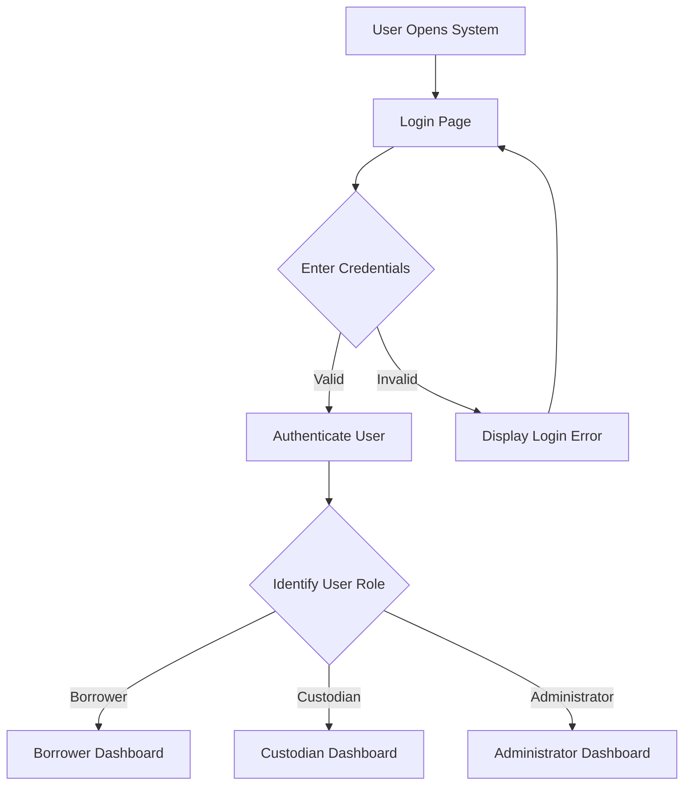

### Password Reset

The system uses **ASP.NET Core Identity** for password recovery.

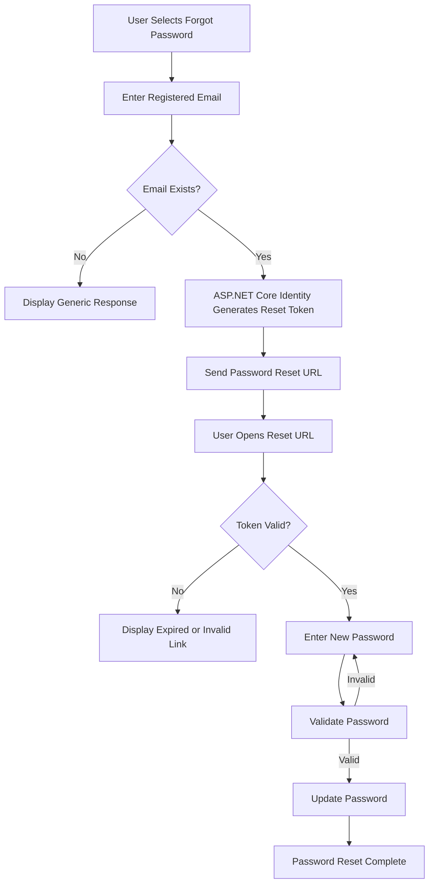

> **Database Note:** No custom `PASSWORD_RESET`, `OTP_CODE`, or `PASSWORD_RESET_TOKEN` table is required. The reset process is handled by ASP.NET Core Identity.

---

## 2. Borrower Workflow

The borrower workflow covers searching equipment, submitting reservations, monitoring reservation status, cancelling reservations, receiving equipment, and returning equipment.

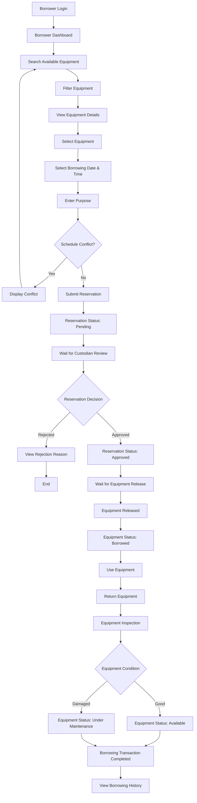

---

## 3. Equipment Search & Availability Workflow

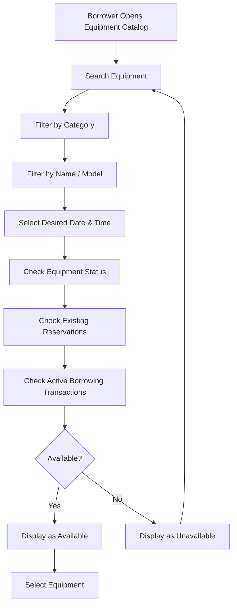

The availability check should consider both the equipment's current status and conflicting reservation schedules.

> **Version 1 data rule:** Each reservation references exactly one physical equipment item. A borrower who needs several items submits one reservation per item.

---

## 4. Reservation Workflow

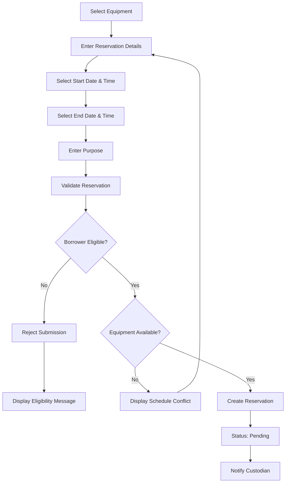

---

## 5. Reservation Approval Workflow

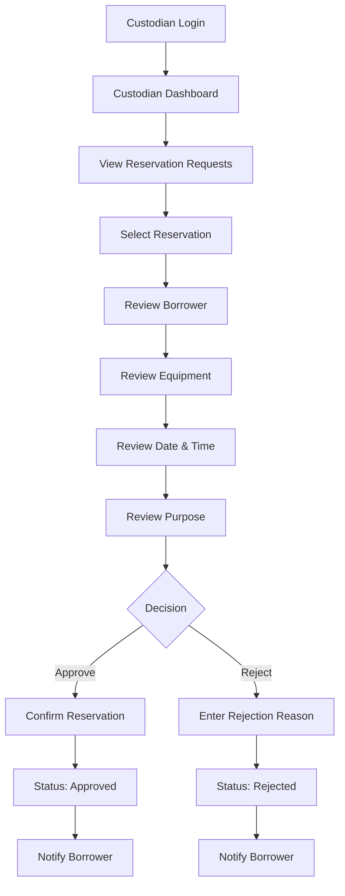

The requirements specify that rejection should include a mandatory explanation visible to the applicant.

---

## 6. Equipment Release Workflow

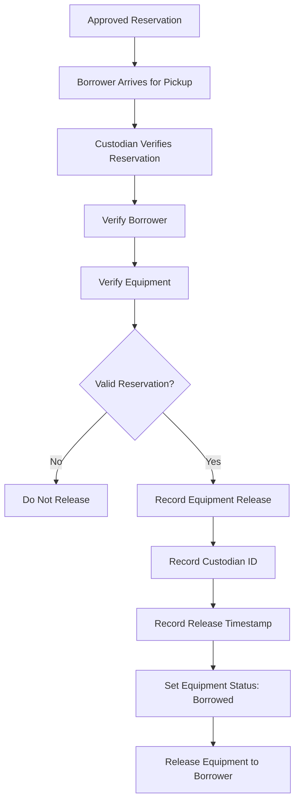

The release transaction records the custodian, actual release timestamp, and changes the equipment status to **Borrowed**.

---

## 7. Equipment Return Workflow

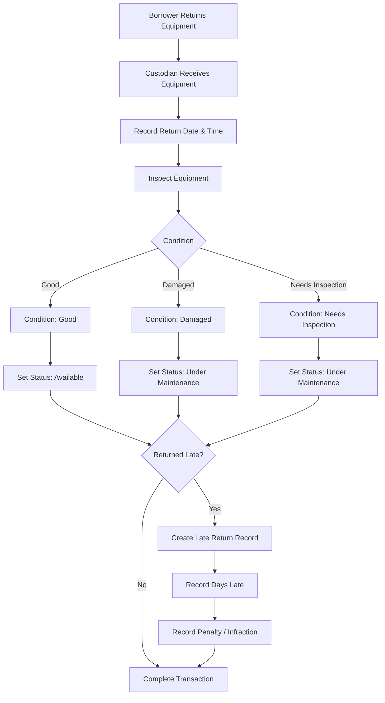

The system identifies late returns and records associated penalties or infractions against the borrower's record.

---

## 8. Equipment Status Lifecycle

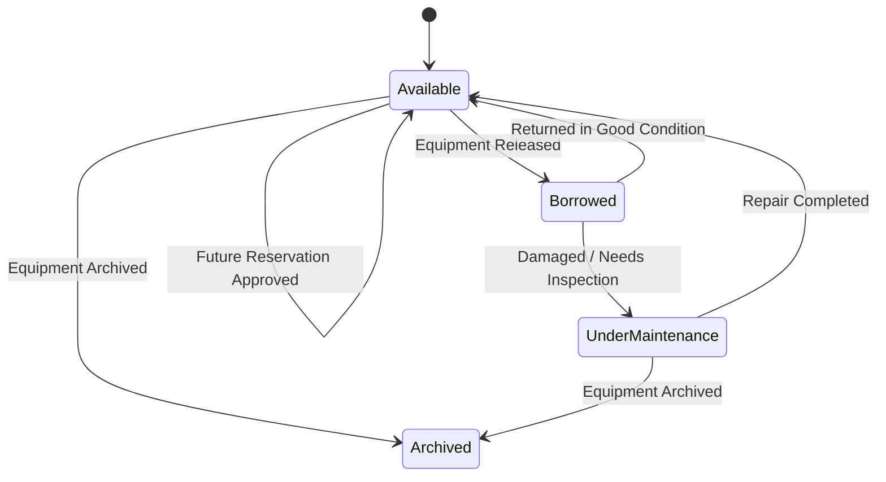

### Main Statuses

| Status | Description |
|---|---|
| **Available** | Equipment can be reserved or released. |
| **Borrowed** | Equipment has been released to a borrower. |
| **Under Maintenance** | Equipment is damaged or requires inspection/repair. |
| **Archived** | Equipment is no longer available for new transactions. |

An approved reservation blocks its scheduled time range but does not permanently change the item's current physical status to `Reserved`. The availability service combines the operational status with approved reservation ranges and active releases.

---

## 9. Late Return Workflow

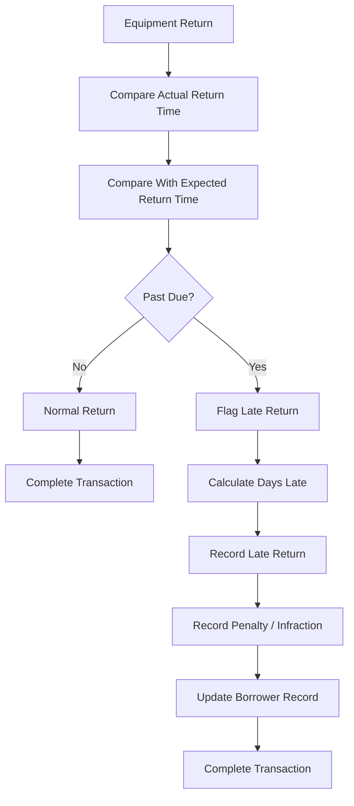

---

## 10. Borrowing History Workflow

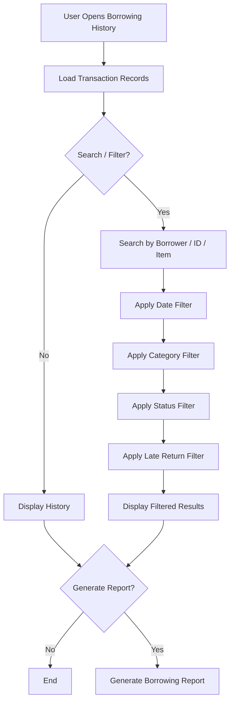

The borrowing history includes completed, cancelled, and overdue transactions and supports searching, filtering, and report generation.

---

## 11. Availability Calendar Workflow

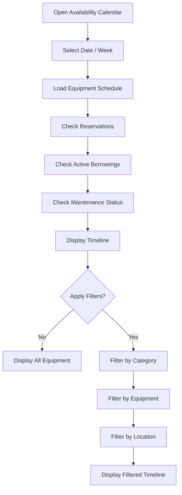

The calendar provides a daily/weekly view of equipment availability, reservations, active borrowing, and maintenance status.

---

## 12. Administrator Workflow

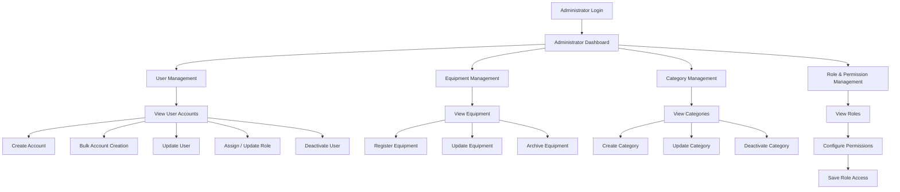

The administrator functions include account creation, bulk CSV account creation, role assignment, permission configuration, user deactivation, and equipment/category management.

---

## 13. Complete System Workflow

The following represents the **high-level workflow of the entire system**:

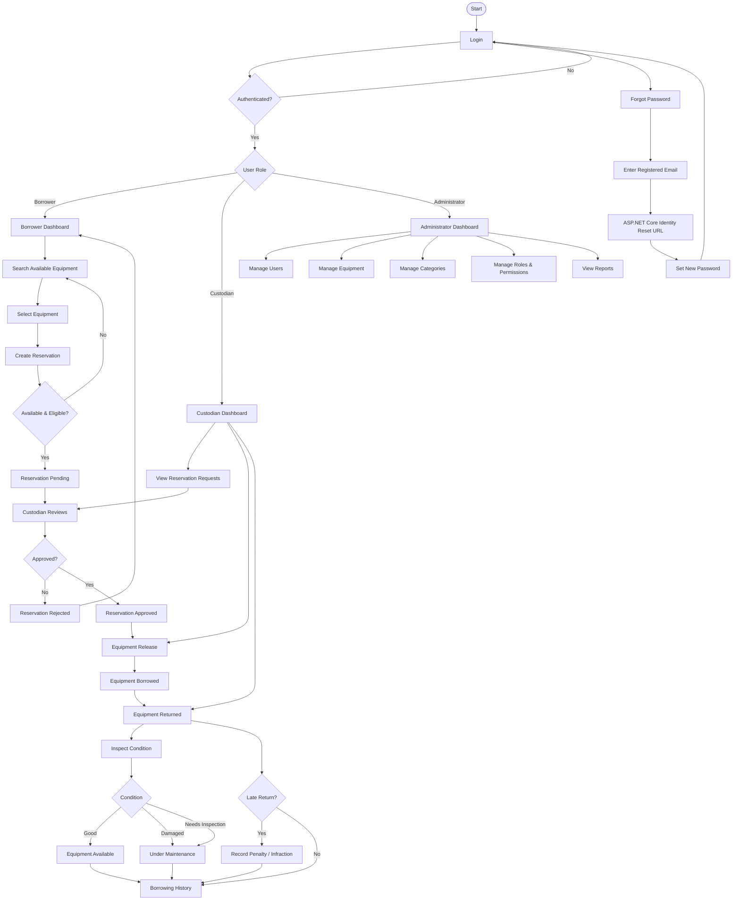

---

## 14. Core Business Process

The most important business process can be summarized as:

```text
Borrower
   │
   ▼
Search Equipment
   │
   ▼
Create Reservation
   │
   ▼
Reservation Pending
   │
   ▼
Custodian Review
   │
   ├─────────────── Reject ──────► End
   │
   ▼
Approve Reservation
   │
   ▼
Equipment Release
   │
   ▼
Equipment Borrowed
   │
   ▼
Equipment Return
   │
   ▼
Condition Inspection
   │
   ├── Good ─────────────► Available
   │
   └── Damaged ──────────► Under Maintenance
   │
   ▼
Check Late Return
   │
   ├── Not Late ─────────► Complete
   │
   └── Late ─────────────► Record Penalty
                              │
                              ▼
                           Complete
```

## 15. Actors

| Actor | Main Responsibilities |
|---|---|
| **Borrower** | Search equipment, submit reservations, view reservation status, cancel reservations, borrow and return equipment, view borrowing history. |
| **Custodian** | Review reservations, approve/reject requests, release equipment, receive returns, inspect equipment, and record late returns. |
| **Administrator** | Manage users, roles, permissions, equipment, categories, and system administration. |

## 16. Authentication Architecture

```text
                    ┌──────────────────────┐
                    │  APPLICATION USER    │
                    └──────────┬───────────┘
                               │
                               ▼
                    ┌──────────────────────┐
                    │ ASP.NET Core Identity│
                    └──────────┬───────────┘
                               │
                ┌──────────────┴──────────────┐
                │                             │
                ▼                             ▼
          Login / Roles               Password Reset
                │                             │
                │                    Cryptographic Token
                │                             │
                │                             ▼
                │                       Reset URL
                │                             │
                ▼                             ▼
        Application Access              New Password
```

**Important:** The password-reset URL/token mechanism is an authentication implementation detail and does **not** introduce a custom entity into the business ERD.

ASP.NET Core Identity stores the account in `AspNetUsers` through the `ApplicationUser` model. School-specific borrowing fields and eligibility are stored separately in `BORROWER_PROFILE`.
