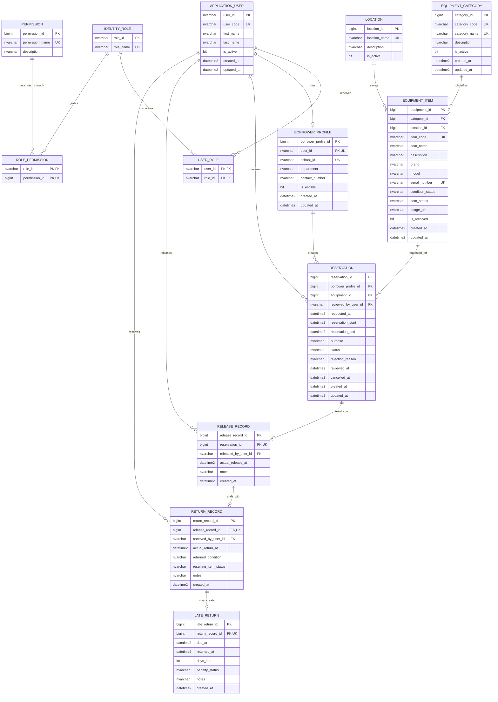
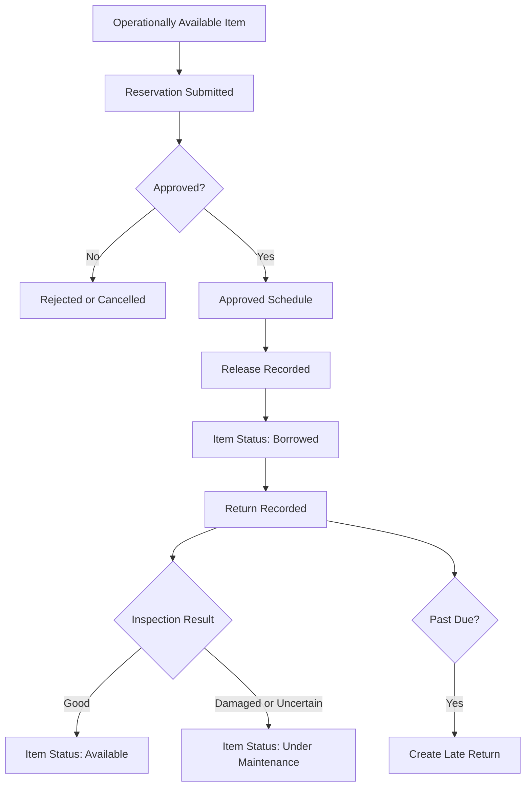

# Campus Equipment Borrowing & Reservation System
## Canonical ERD and SQL Server Data Dictionary

This document is the source of truth for the Version 1 database design. It replaces earlier alternatives that mixed a custom user table with ASP.NET Core Identity or allowed multiple equipment items in one reservation.

## 1. Version 1 Design Decisions

- Microsoft SQL Server is the database engine. SSMS may be used to administer it.
- Entity Framework Core migrations define and update the schema.
- ASP.NET Core Identity owns authentication tables, password hashes, security stamps, lockout data, roles, and password-reset tokens.
- Application-specific account fields extend Identity through `ApplicationUser`.
- Borrowing eligibility and school profile data belong to `BORROWER_PROFILE`, not the authentication record.
- Each reservation contains exactly one physical equipment item.
- A borrower who needs multiple items creates one reservation per item.
- `RELEASE_RECORD`, `RETURN_RECORD`, and `LATE_RETURN` are zero-or-one extensions of the preceding lifecycle record.
- Current physical equipment state is stored on `EQUIPMENT_ITEM`; schedule availability is calculated from approved reservations and active releases.
- SQL Server types and constraints are used throughout.

## 2. Canonical Entity Relationship Diagram



## 3. Identity and Authorization

### 3.1 APPLICATION_USER / `AspNetUsers`

`ApplicationUser` extends ASP.NET Core Identity's user model. The physical table is normally `AspNetUsers`. The columns below are application-specific additions; Identity creates its standard email, normalized-name, password-hash, security-stamp, lockout, and two-factor columns.

| Application column | SQL Server type | Key/nullability | Description |
| --- | --- | --- | --- |
| `user_id` | `NVARCHAR(450)` | PK, not null | Identity user key. |
| `user_code` | `NVARCHAR(100)` | UK, not null | Student, faculty, or employee identifier. |
| `first_name` | `NVARCHAR(100)` | Not null | First name. |
| `last_name` | `NVARCHAR(100)` | Not null | Last name. |
| `is_active` | `BIT` | Not null | Application-level activation state. |
| `created_at` | `DATETIME2` | Not null | Creation time in UTC. |
| `updated_at` | `DATETIME2` | Not null | Last update time in UTC. |

Do not add a custom password column. Passwords must be hashed and managed by ASP.NET Core Identity.

### 3.2 IDENTITY_ROLE and USER_ROLE

Identity stores roles in `AspNetRoles` and user-role assignments in `AspNetUserRoles`.

Expected seeded roles:

- Borrower
- Custodian
- Administrator

`AspNetUserRoles` uses the composite key `(user_id, role_id)`. Version 1 normally assigns one primary operational role to each account, although the Identity schema can support multiple roles.

### 3.3 PERMISSION

| Column | SQL Server type | Key/nullability | Description |
| --- | --- | --- | --- |
| `permission_id` | `BIGINT IDENTITY(1,1)` | PK | Permission identifier. |
| `permission_name` | `NVARCHAR(150)` | UK, not null | Stable capability name. |
| `description` | `NVARCHAR(500)` | Null | Human-readable explanation. |

Recommended names:

- `equipment.browse`
- `reservation.create`
- `reservation.review`
- `transaction.release_return`
- `equipment.manage`
- `borrower.manage`
- `user_role.manage`
- `history.view`

### 3.4 ROLE_PERMISSION

| Column | SQL Server type | Key/nullability | Description |
| --- | --- | --- | --- |
| `role_id` | `NVARCHAR(450)` | PK, FK, not null | References `AspNetRoles.Id`. |
| `permission_id` | `BIGINT` | PK, FK, not null | References `PERMISSION.permission_id`. |

The composite primary key `(role_id, permission_id)` prevents duplicate assignments. Authorization policies must enforce these permissions on backend actions; hiding a button is not sufficient.

## 4. Borrower Profile

### 4.1 BORROWER_PROFILE

| Column | SQL Server type | Key/nullability | Description |
| --- | --- | --- | --- |
| `borrower_profile_id` | `BIGINT IDENTITY(1,1)` | PK | Borrower profile identifier. |
| `user_id` | `NVARCHAR(450)` | FK, UK, not null | References `AspNetUsers.Id`; unique for a one-to-zero-or-one relationship. |
| `school_id` | `NVARCHAR(100)` | UK, not null | School-issued borrower identifier. |
| `department` | `NVARCHAR(200)` | Not null | Academic or organizational unit. |
| `contact_number` | `NVARCHAR(50)` | Null | Contact number. |
| `is_eligible` | `BIT` | Not null | Whether the borrower may create new reservations. |
| `created_at` | `DATETIME2` | Not null | Creation time in UTC. |
| `updated_at` | `DATETIME2` | Not null | Last update time in UTC. |

Only accounts that can borrow need a borrower profile. Authentication state and borrowing eligibility remain separate concerns.

## 5. Equipment Master Data

### 5.1 EQUIPMENT_CATEGORY

| Column | SQL Server type | Key/nullability | Description |
| --- | --- | --- | --- |
| `category_id` | `BIGINT IDENTITY(1,1)` | PK | Category identifier. |
| `category_code` | `NVARCHAR(50)` | UK, not null | Stable category code. |
| `category_name` | `NVARCHAR(150)` | UK, not null | Display name. |
| `description` | `NVARCHAR(1000)` | Null | Category description. |
| `is_active` | `BIT` | Not null | Whether new items may use the category. |
| `created_at` | `DATETIME2` | Not null | Creation time. |
| `updated_at` | `DATETIME2` | Not null | Last update time. |

### 5.2 LOCATION

| Column | SQL Server type | Key/nullability | Description |
| --- | --- | --- | --- |
| `location_id` | `BIGINT IDENTITY(1,1)` | PK | Location identifier. |
| `location_name` | `NVARCHAR(200)` | UK, not null | Storage or facility name. |
| `description` | `NVARCHAR(1000)` | Null | Additional details. |
| `is_active` | `BIT` | Not null | Whether the location can be assigned. |

### 5.3 EQUIPMENT_ITEM

| Column | SQL Server type | Key/nullability | Description |
| --- | --- | --- | --- |
| `equipment_id` | `BIGINT IDENTITY(1,1)` | PK | Physical item identifier. |
| `category_id` | `BIGINT` | FK, not null | References `EQUIPMENT_CATEGORY`. |
| `location_id` | `BIGINT` | FK, not null | References `LOCATION`. |
| `item_code` | `NVARCHAR(100)` | UK, not null | Institutional inventory code. |
| `item_name` | `NVARCHAR(200)` | Not null | Display name. |
| `description` | `NVARCHAR(MAX)` | Null | Detailed description. |
| `brand` | `NVARCHAR(150)` | Null | Manufacturer or brand. |
| `model` | `NVARCHAR(150)` | Null | Model. |
| `serial_number` | `NVARCHAR(200)` | Filtered UK, null | Manufacturer serial number when present. |
| `condition_status` | `NVARCHAR(50)` | Not null | Current physical condition. |
| `item_status` | `NVARCHAR(50)` | Not null | Current operational state. |
| `image_url` | `NVARCHAR(500)` | Null | Relative path or approved URL. |
| `is_archived` | `BIT` | Not null | Prevents future transactions when true. |
| `created_at` | `DATETIME2` | Not null | Creation time. |
| `updated_at` | `DATETIME2` | Not null | Last update time. |

Required filtered index:

```sql
CREATE UNIQUE INDEX UX_EquipmentItem_SerialNumber
ON EquipmentItem (SerialNumber)
WHERE SerialNumber IS NOT NULL;
```

Suggested condition values: `Good`, `Damaged`, `NeedsInspection`, and `UnderRepair`.

Suggested operational status values: `Available`, `Borrowed`, `UnderMaintenance`, `Unavailable`, and `Archived`.

An approved future reservation does not permanently change the item's current physical status to `Reserved`. Availability for a requested period is calculated from the item status, approved reservation ranges, and active release records.

## 6. Reservation and Transaction Data

### 6.1 RESERVATION

Each reservation contains exactly one equipment item.

| Column | SQL Server type | Key/nullability | Description |
| --- | --- | --- | --- |
| `reservation_id` | `BIGINT IDENTITY(1,1)` | PK | Reservation identifier. |
| `borrower_profile_id` | `BIGINT` | FK, not null | Borrower submitting the request. |
| `equipment_id` | `BIGINT` | FK, not null | Requested physical item. |
| `reviewed_by_user_id` | `NVARCHAR(450)` | FK, null | Custodian/administrator who decided the request. |
| `requested_at` | `DATETIME2` | Not null | Submission time. |
| `reservation_start` | `DATETIME2` | Not null | Requested start. |
| `reservation_end` | `DATETIME2` | Not null | Requested return/due time. |
| `purpose` | `NVARCHAR(1000)` | Not null | Borrowing purpose. |
| `status` | `NVARCHAR(50)` | Not null | `Pending`, `Approved`, `Rejected`, `Cancelled`, or `Expired`. |
| `rejection_reason` | `NVARCHAR(1000)` | Null | Required when rejected. |
| `reviewed_at` | `DATETIME2` | Null | Decision time. |
| `cancelled_at` | `DATETIME2` | Null | Cancellation time. |
| `created_at` | `DATETIME2` | Not null | Creation time. |
| `updated_at` | `DATETIME2` | Not null | Last update time. |

Required rules:

- `reservation_start < reservation_end`.
- The borrower account must be active and the profile eligible.
- The equipment item must not be archived, unavailable, borrowed, or under maintenance for the requested period.
- Approved ranges for the same item must not overlap.
- Rejected reservations require `rejection_reason`, `reviewed_by_user_id`, and `reviewed_at`.
- Cancelled reservations require `cancelled_at`.

Overlap validation is a transactional business rule and cannot be represented by a simple unique constraint. Recheck conflicts during approval inside an appropriate SQL Server transaction.

### 6.2 RELEASE_RECORD

| Column | SQL Server type | Key/nullability | Description |
| --- | --- | --- | --- |
| `release_record_id` | `BIGINT IDENTITY(1,1)` | PK | Release identifier. |
| `reservation_id` | `BIGINT` | FK, UK, not null | Approved reservation being fulfilled. |
| `released_by_user_id` | `NVARCHAR(450)` | FK, not null | Custodian/administrator performing handover. |
| `actual_release_at` | `DATETIME2` | Not null | Actual handover time. |
| `notes` | `NVARCHAR(1000)` | Null | Release notes. |
| `created_at` | `DATETIME2` | Not null | Record creation time. |

The unique `reservation_id` permits at most one release per reservation. Creating a release changes the equipment's current operational status to `Borrowed`.

### 6.3 RETURN_RECORD

| Column | SQL Server type | Key/nullability | Description |
| --- | --- | --- | --- |
| `return_record_id` | `BIGINT IDENTITY(1,1)` | PK | Return identifier. |
| `release_record_id` | `BIGINT` | FK, UK, not null | Release being completed. |
| `received_by_user_id` | `NVARCHAR(450)` | FK, not null | Custodian/administrator receiving the item. |
| `actual_return_at` | `DATETIME2` | Not null | Actual return time. |
| `returned_condition` | `NVARCHAR(50)` | Not null | Condition found during inspection. |
| `resulting_item_status` | `NVARCHAR(50)` | Not null | Status applied after inspection. |
| `notes` | `NVARCHAR(1000)` | Null | Inspection notes. |
| `created_at` | `DATETIME2` | Not null | Record creation time. |

The unique `release_record_id` permits at most one return per release. Good items may return to `Available`; damaged or uncertain items must become `UnderMaintenance` or `Unavailable`.

### 6.4 LATE_RETURN

| Column | SQL Server type | Key/nullability | Description |
| --- | --- | --- | --- |
| `late_return_id` | `BIGINT IDENTITY(1,1)` | PK | Late-return identifier. |
| `return_record_id` | `BIGINT` | FK, UK, not null | Late return being documented. |
| `due_at` | `DATETIME2` | Not null | Reservation due time. |
| `returned_at` | `DATETIME2` | Not null | Actual return time. |
| `days_late` | `INT` | Not null | Validated whole-day policy result. |
| `penalty_status` | `NVARCHAR(50)` | Not null | School-defined infraction/penalty state. |
| `notes` | `NVARCHAR(1000)` | Null | Additional details. |
| `created_at` | `DATETIME2` | Not null | Record creation time. |

A late-return row may exist only when `returned_at > due_at`. The application derives and validates `days_late` according to the institution's policy.

## 7. Relationship Summary

| Parent | Child | Cardinality | Foreign key |
| --- | --- | --- | --- |
| `AspNetUsers` | `AspNetUserRoles` | 1:M | `user_id` |
| `AspNetRoles` | `AspNetUserRoles` | 1:M | `role_id` |
| `AspNetRoles` | `ROLE_PERMISSION` | 1:M | `role_id` |
| `PERMISSION` | `ROLE_PERMISSION` | 1:M | `permission_id` |
| `AspNetUsers` | `BORROWER_PROFILE` | 1:0..1 | `user_id` |
| `EQUIPMENT_CATEGORY` | `EQUIPMENT_ITEM` | 1:M | `category_id` |
| `LOCATION` | `EQUIPMENT_ITEM` | 1:M | `location_id` |
| `BORROWER_PROFILE` | `RESERVATION` | 1:M | `borrower_profile_id` |
| `EQUIPMENT_ITEM` | `RESERVATION` | 1:M | `equipment_id` |
| `AspNetUsers` | `RESERVATION` | 1:M | `reviewed_by_user_id` |
| `RESERVATION` | `RELEASE_RECORD` | 1:0..1 | `reservation_id` |
| `AspNetUsers` | `RELEASE_RECORD` | 1:M | `released_by_user_id` |
| `RELEASE_RECORD` | `RETURN_RECORD` | 1:0..1 | `release_record_id` |
| `AspNetUsers` | `RETURN_RECORD` | 1:M | `received_by_user_id` |
| `RETURN_RECORD` | `LATE_RETURN` | 1:0..1 | `return_record_id` |

## 8. Delete and History Rules

- Do not cascade-delete users, borrower profiles, equipment, reservations, releases, or returns when historical records exist.
- Deactivate accounts, categories, and locations instead of deleting them.
- Archive equipment instead of deleting it.
- Restrict deletion of referenced master data.
- Preserve Identity users involved in historical transactions; disable sign-in through `is_active` and Identity lockout as appropriate.
- Store all application timestamps in UTC and convert them for display.

## 9. Lifecycle



## 10. Final Entity List

1. `APPLICATION_USER` / Identity `AspNetUsers`
2. `IDENTITY_ROLE` / Identity `AspNetRoles`
3. `USER_ROLE` / Identity `AspNetUserRoles`
4. `PERMISSION`
5. `ROLE_PERMISSION`
6. `BORROWER_PROFILE`
7. `EQUIPMENT_CATEGORY`
8. `LOCATION`
9. `EQUIPMENT_ITEM`
10. `RESERVATION`
11. `RELEASE_RECORD`
12. `RETURN_RECORD`
13. `LATE_RETURN`

Other ASP.NET Core Identity support tables are created by Identity migrations but are omitted from this business-focused ERD.
