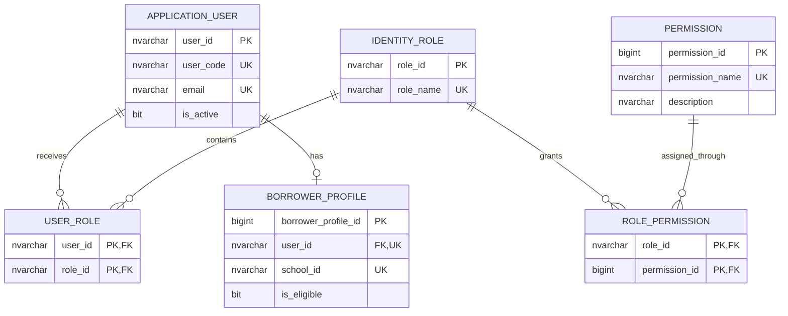
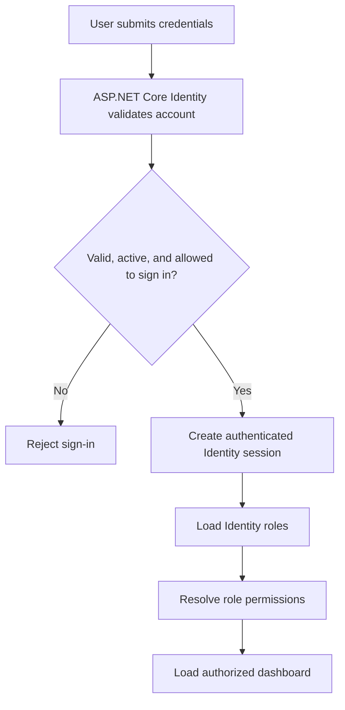

# Campus Equipment Borrowing & Reservation System
## Identity Role and Permission Workflow

## 1. Overview

ASP.NET Core Identity authenticates accounts and stores users, roles, password hashes, security metadata, and user-role assignments in SQL Server. Application permissions add finer-grained control over pages and actions.

```text
ApplicationUser (AspNetUsers)
        │
        ▼
UserRole (AspNetUserRoles)
        │
        ▼
IdentityRole (AspNetRoles)
        │
        ▼
RolePermission
        │
        ▼
Permission
        │
        ▼
Allow or deny the action
```

The `BorrowerProfile` table is separate from authentication. It stores school ID, department, contact information, and borrowing eligibility for users who can borrow equipment.

## 2. Roles

| Role | Code | Responsibility |
| --- | --- | --- |
| Borrower | BRW | Browse equipment and submit one-item reservation requests. |
| Custodian | CUS | Review requests and record equipment release and return. |
| Administrator | ADM | Manage users, roles, permissions, borrower profiles, and equipment. |

These roles are seeded as ASP.NET Core Identity roles.

## 3. Permission Matrix

| Capability | BRW | CUS | ADM |
| --- | :---: | :---: | :---: |
| Browse catalog and calendar | ✓ | ✓ | ✓ |
| Submit reservation request | ✓ |  |  |
| Approve or reject request |  | ✓ | ✓ |
| Record release and return |  | ✓ | ✓ |
| Maintain equipment, categories, and locations |  |  | ✓ |
| Maintain borrower profiles |  |  | ✓ |
| Manage users, roles, and permissions |  |  | ✓ |
| View borrowing history report |  | ✓ | ✓ |

The matrix is an administrative interface over `ROLE_PERMISSION`.

## 4. Canonical Database Structure



Physical Identity tables normally use the names `AspNetUsers`, `AspNetRoles`, and `AspNetUserRoles`. Other standard Identity support tables are created by Identity migrations.

There is no custom password column in the business schema. ASP.NET Core Identity manages password hashing, reset tokens, security stamps, lockout, and related security data.

## 5. Permission Records

| Permission | Capability |
| --- | --- |
| `equipment.browse` | Browse the catalog and availability calendar. |
| `reservation.create` | Submit a reservation for one equipment item. |
| `reservation.review` | Approve or reject reservations. |
| `transaction.release_return` | Record equipment release and return. |
| `equipment.manage` | Maintain equipment, categories, and locations. |
| `borrower.manage` | Maintain borrower profiles and eligibility. |
| `user_role.manage` | Manage accounts, roles, and role permissions. |
| `history.view` | View borrowing history and reports. |

Permission names are stable identifiers used by authorization policies. Display labels may be localized without changing these identifiers.

## 6. Administrative Configuration

```text
Administrator
    │
    ▼
Role and Permission Management
    │
    ▼
Select an Identity role
    │
    ▼
Load all permissions and current RolePermission rows
    │
    ▼
Enable or disable capabilities
    │
    ▼
Validate administrator permission
    │
    ▼
Save RolePermission changes in a transaction
```

Only a user with `user_role.manage` may change role-permission assignments. Changes should be logged with the acting user and timestamp.

## 7. Login and Authorization Workflow



`ApplicationUser.IsActive` must be checked during sign-in. Borrowing eligibility is separate: an authenticated user may be active but temporarily unable to create a reservation because `BorrowerProfile.IsEligible` is false.

## 8. UI and Backend Enforcement

The interface may hide menu items and buttons that the current user cannot use, but UI checks are only a convenience.

Every protected controller action must also enforce the required role or permission:

```text
Request reaches MVC controller action
        │
        ▼
Is the user authenticated and active?
        │
        ▼
Does a current role grant the required permission?
        │
   ┌────┴────┐
  Yes        No
   │          │
   ▼          ▼
Execute      Return 403
```

Example:

```text
POST /Reservations/123/Approve
Required permission: reservation.review
```

The service layer must still validate reservation status, schedule conflicts, and concurrency. Authorization answers who may try the action; business validation determines whether the action is valid.

## 9. Deny by Default

- A missing permission means deny.
- A hidden UI control does not authorize an endpoint.
- Borrowers may access only their own reservations and borrowing history.
- Custodians may review, release, and return according to their permissions.
- Administrators may manage configuration only when the corresponding permission is assigned.
- Deactivated users must not sign in or perform protected operations.

## 10. Permission Lifecycle

1. The system seeds Identity roles and application permissions.
2. An administrator assigns permissions to a role.
3. An administrator assigns an Identity role to a user.
4. The user signs in through ASP.NET Core Identity.
5. The application resolves the user's current roles and permissions.
6. MVC navigation displays permitted functions.
7. The user requests an action.
8. The controller authorization policy checks the permission.
9. The business service validates the operation.
10. The system allows the action or returns an appropriate denial/error.

## Summary

ASP.NET Core Identity owns authentication and role membership. The custom `PERMISSION` and `ROLE_PERMISSION` tables define application capabilities. `BORROWER_PROFILE` owns borrowing eligibility and school-specific borrower data. Backend authorization policies are the final enforcement point.
