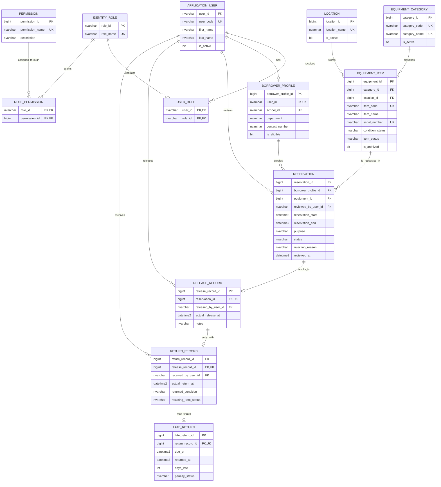

# Canonical Entity Relationship Diagram

This is the simplified visual reference for the Version 1 Campus Equipment Borrowing & Reservation System. The authoritative field definitions and SQL Server constraints are in `Campus_Equipment_Borrowing_ERD_Data_Dictionary.md`.

## Design Decisions

- ASP.NET Core Identity manages users, password hashes, roles, sign-in, and reset tokens.
- `ApplicationUser` extends Identity with application-specific account fields.
- `BorrowerProfile` stores school identity, department, contact, and borrowing eligibility.
- Each reservation contains exactly one equipment item.
- A borrower requests multiple items by creating multiple reservations.
- SQL Server is the database engine; SSMS is an optional administration tool.

## Cardinality Summary

| Relationship | Cardinality | Meaning |
| --- | --- | --- |
| Application User → Borrower Profile | 1:0..1 | Only borrowing accounts need a borrower profile. |
| Role → Permission | M:N | `ROLE_PERMISSION` assigns capabilities to Identity roles. |
| Category → Equipment Item | 1:M | Each item belongs to one category. |
| Location → Equipment Item | 1:M | Each item has one current location. |
| Borrower Profile → Reservation | 1:M | A borrower can submit many requests. |
| Equipment Item → Reservation | 1:M | An item can appear in many historical reservations, but approved times cannot overlap. |
| Reservation → Release Record | 1:0..1 | Only a fulfilled approved reservation is released. |
| Release Record → Return Record | 1:0..1 | A release receives one return when the loan ends. |
| Return Record → Late Return | 1:0..1 | A late-return record exists only when the item was returned past its due time. |

## Important Rules

- `AspNetUsers` and the other standard Identity tables remain part of the physical database even when not fully shown here.
- No custom password, password-reset, or OTP columns/tables are required.
- Reservation start must be earlier than reservation end.
- Approval must recheck schedule overlap in a SQL Server transaction.
- Optional serial numbers require a filtered unique index.
- Historical transaction rows must not be cascade-deleted.
